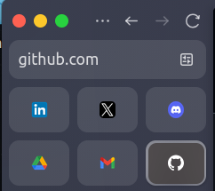
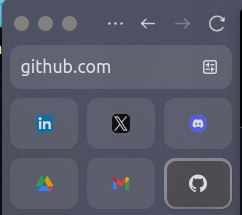

# Zen WhiteSur Title Bar

A Zen Browser mod that customizes the window title buttons (close, minimize, maximize) to resemble the WhiteSur (macOS-like) theme.  
Forked from [Dinno-DEV](https://github.com/Dinno-DEV/zen-minimal-exit-menu).

## Preview

#### Active Window

#### Inactive Window

## Features

- Minimalist title bar buttons inspired by WhiteSur (macOS).
- Close, minimize, and maximize buttons styled as three colored circles.
- Smooth hover and inactive state effects.
- Simple, lightweight, and easy to maintain.

## Installation

1. Open **Zen Browser** preferences.
2. Go to **Mods** section.
3. Import or copy this mod’s CSS into your Zen Mods directory.
4. Enable the mod in Zen settings.

## Credits

- Original project by [Dinno-DEV](https://github.com/Dinno-DEV).
- Modified and adapted for WhiteSur/macOS style by [SywlAchmd](https://github.com/SywlAchmd).
